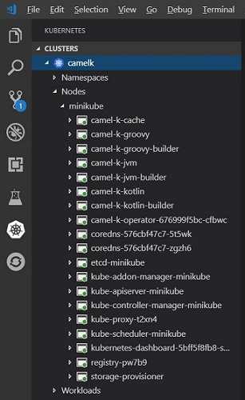
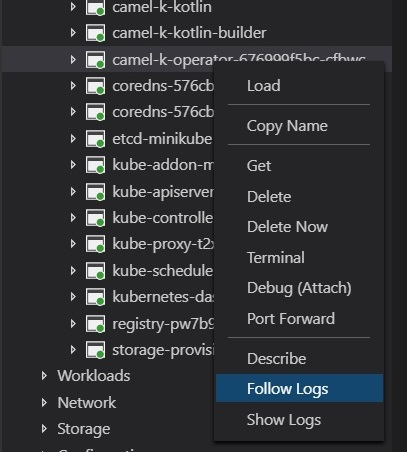
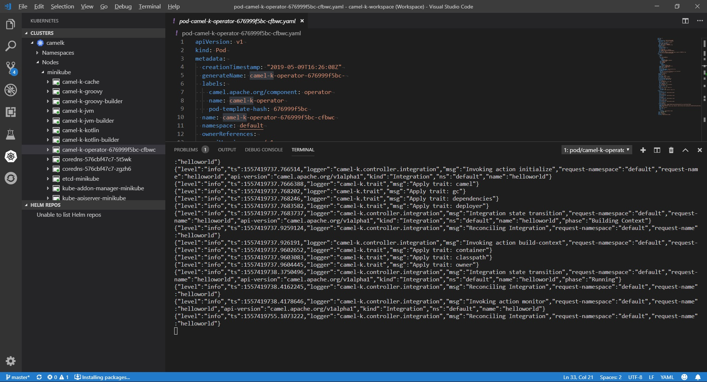
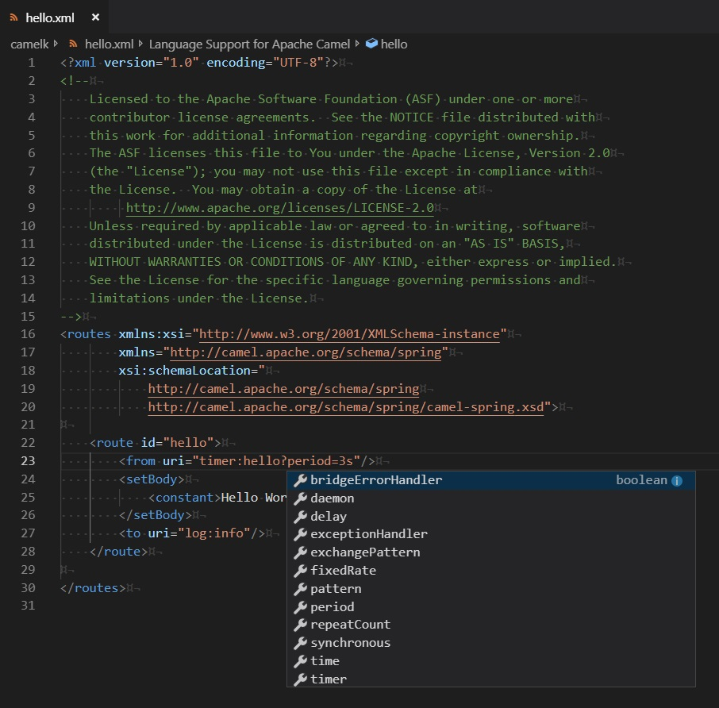
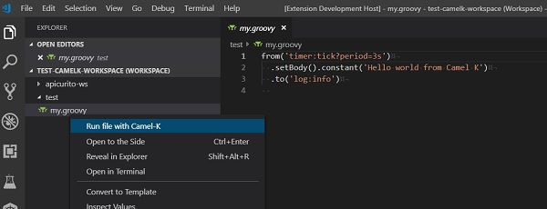
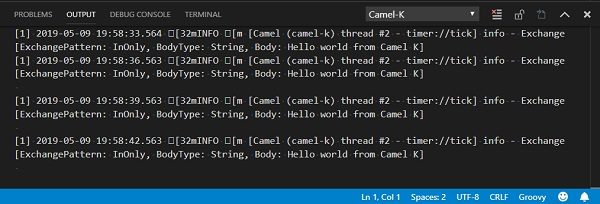
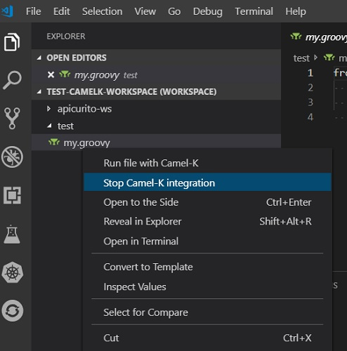

# Camel-K Exploration

I was tasked with trying to figure out ways to make Camel-K more accessible to users in VS Code, so I started by exploring Camel-K with Minikube.

* To install [Camel-K](https://github.com/apache/camel-k), grab the latest release (such as [0.3.3](https://github.com/apache/camel-k/releases/tag/0.3.3) and make accessible on the path.
* To install Minikube, I followed the directions [here](https://github.com/apache/camel-k/blob/master/docs/cluster-setup.adoc). [This link](https://kubernetes.io/docs/tasks/tools/install-minikube/) was also very helpful.
* I then created a local folder with two files - start.sh and helloworld.groovy. The source for start.sh is [here](https://github.com/apache/camel-k/blob/master/docs/cluster-setup.adoc) and the source for helloworld.groovy is [here](https://camel.apache.org/staging/camel-k/latest/running/running.html). I recommend adding " -v5" to the end of the last line of start.sh to enable a bit more logging.

Once "kamel" and Minikube were installed, I worked through these steps with the help of Zoran Regvart and Andrea Tarocchi.

## Steps (With minikube and kamel installed on system)

1. Execute `./start.sh`
2. Run `kamel install --cluster-setup`
3. Run `kamel install`
4. Run `minikube addons enable registry` (If "registry" pod doesn't show up when you do the next step, note registry issue we hit below with the resolution.)
5. Run `kubectl get pods --all-namespaces` (to get the id for the camel-k-operator and make sure all pods are running)
6. Run `kubectl log -f camel-k-operator-[id]` (after get full pod name from "get pods" - it will be something like camel-k-operator-676999f5bc-cfbwc - and this command makes it so you can watch the camel log)
7. Run your route in another console with `kamel run --dev helloworld.groovy`
8. Monitor the console and the log to ensure that everything looks good.
9. To stop your camelk processes, run `minikube stop -p camelk`
10. You can restart later without running the start.sh script by just using `minikube start -p camelk`

### Issue enabling registry addon

Update: Looks like this has been fixed upstream for a later version of minikube.

Unfortunately, we hit a problem with the script called to enable the registry. You can find that script [here](https://github.com/kubernetes/minikube/blob/master/deploy/addons/registry/registry-rc.yaml.tmpl#L28). On line 28, true needs to be “true”.

You can fix this locally to get past it. Download the file, make the fix, and then install by running `kubectl -n kube-system create -f my-modified-registry.yaml`

## Minikube + Camel-K in VS Code

The [Kubernetes Tools extension from Microsoft](https://marketplace.visualstudio.com/items?itemName=ms-kubernetes-tools.vscode-kubernetes-tools) offers a number of cool tools we can use with Minikube and Camel-K.

Once the Camel-K pods have started in Minikube, you can see them show up in the Kubernetes Activity view. This removes the need to explicitly do step 5 above:



A cool feature of the Kubernetes view is when you right-click on a pod under the minikube node, you get a pop-up menu that allows you to "Follow Logs"...



...which opens the log for that pod in a new Terminal window.



With [Language Support for Apache Camel](https://marketplace.visualstudio.com/items?itemName=camel-tooling.vscode-apache-camel) installed, you also get LSP support for Camel XML and Java routes:



At this time, you still have to run step 7 from above in a separate Terminal, but I think we can help with that by providing a specialized right-click menu option for running a Kamel service.

## Possible VS Code extension to provide 'Run' menu

Note that this extension code is available here: <https://github.com/bfitzpat/vscode-camelk>

If Camel-K (Kamel) is in the system path, we can simply call the 'kamel' utility with appropriate options to run a particular file when the user wishes. For example, if I have a simple workspace with a Groovy file...



That launches my 'kamel' process (i.e. `kamel run --dev "complete/file/path"`) and I can see the output:



Current issues with this approach include:

* No way I can see to stop the process once it's running. I can start it, but I can't stop it with a second call.
* I noticed that file paths with spaces definitely do not work properly.

```bash
Command string: kamel run --dev "c:\Users\brianf\Documents\Visual Studio 2017\Workspaces\apicurito-ws\blah\my.groovy"
[OUT] integration "cusersbrianfdocumentsvisual-studio-2017workspacesapicurito-wsblahmy" updated
[OUT] integration "cusersbrianfdocumentsvisual-studio-2017workspacesapicurito-wsblahmy" in phase Deploying
```

It just hangs there. Long paths with NO spaces seems to work.

```bash
Command string: kamel run --dev "c:\test\my.groovy"
[OUT] integration "ctestmy" updated
[OUT] integration "ctestmy" in phase Running
[OUT] [1] Monitoring pod ctestmy-999565cbd-qkx6v[1] Starting the Java application using /opt/run-java/run-java.sh ...
[OUT] [1] exec java -XX:+UseParallelGC -XX:GCTimeRatio=4 -XX:AdaptiveSizePolicyWeight=90 -XX:MinHeapFreeRatio=20 -XX:MaxHeapFreeRatio=40 -XX:+ExitOnOutOfMemoryError -cp ./resources:/etc/camel/conf:/etc/camel/resources:/etc/camel/sources/i-source-000:dependencies/com.sun.xml.bind.jaxb-core-2.3.0.jar:dependencies/com.sun.xml.bind.jaxb-impl-2.3.0.jar:dependencies/commons-io.commons-io-2.6.jar:dependencies/org.apache.camel.camel-core-2.23.2.jar:dependencies/org.apache.camel.camel-groovy-2.23.2.jar:dependencies/org.apache.camel.k.camel-k-adapter-camel-2-0.3.2.jar:dependencies/org.apache.camel.k.camel-k-runtime-core-0.3.2.jar:dependencies/org.apache.camel.k.camel-k-runtime-groovy-0.3.2.jar:dependencies/org.apache.camel.k.camel-k-runtime-jvm-0.3.2.jar:dependencies/org.apache.commons.commons-lang3-3.8.1.jar:dependencies/org.apache.logging.log4j.log4j-api-2.11.2.jar:dependencies/org.apache.logging.log4j.log4j-core-2.11.2.jar:dependencies/org.apache.logging.log4j.log4j-slf4j-impl-2.11.2.jar:dependencies/org.codehaus.groovy.groovy-2.5.4.jar:dependencies/org.jooq.joor-java-8-0.9.10.jar:dependencies/org.slf4j.slf4j-api-1.7.25.jar org.apache.camel.k.jvm.Application
[1] OpenJDK 64-Bit Server VM warning: If the number of processors is expected to increase from one, then you should configure the number of parallel GC threads appropriately using -XX:ParallelGCThreads=N
[1] 2019-05-09 19:46:25.404 INFO  [main] ApplicationRuntime - Add listener: org.apache.camel.k.listener.ContextConfigurer@3f197a46
[1] 2019-05-09 19:46:25.407 INFO  [main] ApplicationRuntime - Add listener: org.apache.camel.k.listener.ContextLifecycleConfigurer@72f926e6
[1] 2019-05-09 19:46:25.408 INFO  [main] ApplicationRuntime - Add listener: org.apache.camel.k.listener.RoutesConfigurer@481a996b
[1] 2019-05-09 19:46:25.410 INFO  [main] ApplicationRuntime - Add listener: org.apache.camel.k.listener.RoutesDumper@28eaa59a
[1] 2019-05-09 19:46:25.650 INFO  [main] RoutesConfigurer - Loading routes from: file:/etc/camel/sources/i-source-000/c:\test\my.groovy?language=groovy
[1] 2019-05-09 19:46:26.240 INFO  [main] DefaultCamelContext - Apache Camel 2.23.2 (CamelContext: camel-k) is starting
[1] 2019-05-09 19:46:26.244 INFO  [main] ManagedManagementStrategy - JMX is enabled
[1] 2019-05-09 19:46:26.361 INFO  [main] DefaultTypeConverter - Type converters loaded (core: 195, classpath: 0)
[1] 2019-05-09 19:46:26.460 INFO  [main] DefaultCamelContext - StreamCaching is not in use. If using streams then its recommended to enable stream caching. See more details at http://camel.apache.org/stream-caching.html
[1] 2019-05-09 19:46:26.522 INFO  [main] DefaultCamelContext - Route: route1 started and consuming from: timer://tick?period=3s
[1] 2019-05-09 19:46:26.526 INFO  [main] DefaultCamelContext - Total 1 routes, of which 1 are started
[1] 2019-05-09 19:46:26.527 INFO  [main] DefaultCamelContext - Apache Camel 2.23.2 (CamelContext: camel-k) started in 0.286 seconds
[1] 2019-05-09 19:46:27.535 INFO  [Camel (camel-k) thread #2 - timer://tick] info - Exchange[ExchangePattern: InOnly, BodyType: String, Body: Hello world from Camel K]
```

## Possible extension to provide 'Stop' menu

In addition, Zoran created a new menu to 'Stop' a running integration based on the filename.



This menu essentially calls `kamel delete '${filename}'` to stop the running integration.

## Other useful links

* <https://github.com/apache/camel-k>
* <https://github.com/apache/camel-k/blob/master/docs/cluster-setup.adoc>
* <https://camel.apache.org/staging/camel-k/latest/index.html>
* <https://kubernetes.io/docs/tasks/debug-application-cluster/debug-application/>
* <https://kubernetes.io/docs/reference/kubectl/cheatsheet/>
* <https://kubernetes.io/docs/tasks/access-application-cluster/list-all-running-container-images/>
* <https://kubernetes.io/docs/tasks/tools/install-minikube/>

## Notes

* Getting a development environment setup locally seems to be the trickiest part, but once it's up and running it's pretty easy to run a Camel configuration and watch the log.
* Sanity note: Minikube is very slow on Windows, but much easier to work with on a linux (Fedora 30 in my case) box.

## Changes

* Initial version of this file added [8-MAY-2019]
* Added images for VS Code components aiding in certain steps (Kubernetes) [9-MAY-2019]
* Added images for possible VS Code extension that provides 'run' menu for certain file types [9-MAY-2019]
* Zoran created a PR that added a 'Stop Camel-K Integration' menu [10-MAY-2019]

## Next steps

* See about getting a list of integrations and providing a view so users can delete them and interact with them in other ways once deployed to minikube.
* Work through installing Camel-k on minishift and see if we can use the VS Code OpenShift tools and work through a similar workflow.
